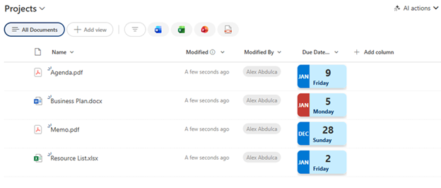

# Date Calendar Card

## Summary

Displays a date field as a visual calendar card with the month displayed vertically on the left side and the day number prominently shown. The card highlights today's date in red and shows the day of the week. Perfect for deadline tracking, event dates, or any date-focused list.

## View requirements

|Type|Internal Name|Required|
|---|---|:---:|
|Date and Time|Any date column|Yes|

## Version history

Version|Date|Comments
-------|----|--------
1.0|January 2026|Initial release

## Disclaimer

**THIS CODE IS PROVIDED *AS IS* WITHOUT WARRANTY OF ANY KIND, EITHER EXPRESS OR IMPLIED, INCLUDING ANY IMPLIED WARRANTIES OF FITNESS FOR A PARTICULAR PURPOSE, MERCHANTABILITY, OR NON-INFRINGEMENT.**

---

## Additional notes

### Features
- **Visual calendar card design** with shadow and rounded corners
- **Month abbreviation** displayed vertically in a colored sidebar
- **Large day number** for easy scanning
- **Today highlighting** - automatically shows red background for current date, blue for other dates
- **Day of week** displayed below the date
- **Responsive layout** that adapts to column width

### Customization
You can customize the colors by modifying these values in the JSON:
- Today's date background: `#c43b33` (red)
- Other dates background: `#0078d4` (blue)
- Card background: `#c7edff` (light blue)

### Usage Tips
- Works with any Date and Time column
- Best viewed in list views with adequate column width (recommended: 150-200px)
- Empty date fields will not display any card

## References

- [Use column formatting to customize SharePoint](https://docs.microsoft.com/en-us/sharepoint/dev/declarative-customization/column-formatting)