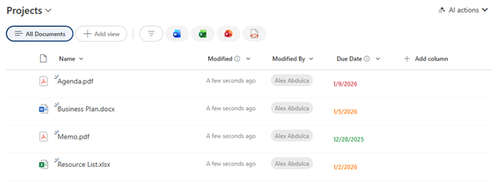

# Date Deadline Status

## Summary

Displays a date field with color-coded status to quickly identify overdue, upcoming, and completed deadlines. Overdue dates appear in red, dates within the past week in orange, and older dates in green.

## View requirements

|Type|Internal Name|Required|
|---|---|:---:|
|Date and Time|Any date column|Yes|

## Version history

Version|Date|Comments
-------|----|--------
1.0|January 2026|Initial release

## Disclaimer

**THIS CODE IS PROVIDED *AS IS* WITHOUT WARRANTY OF ANY KIND, EITHER EXPRESS OR IMPLIED, INCLUDING ANY IMPLIED WARRANTIES OF FITNESS FOR A PARTICULAR PURPOSE, MERCHANTABILITY, OR NON-INFRINGEMENT.**

---

## Additional notes

### Features
- **Overdue (Red):** Dates in the future (upcoming deadlines)
- **Recent (Orange):** Dates within the past 7 days
- **Completed (Green):** Dates older than 7 days
- **Bold text** for easy visibility

### Customization
You can customize the colors and time thresholds:
- Overdue color: `#dc3545` (red)
- Recent color: `#ff7f07` (orange)
- Completed color: `#28a745` (green)
- Recent threshold: `604800000` milliseconds (7 days)

### Usage Tips
- Ideal for tracking task due dates, project milestones, or completion dates
- Works with any Date and Time column
- The 7-day threshold can be adjusted by changing `604800000` (milliseconds)

## References

- [Use column formatting to customize SharePoint](https://docs.microsoft.com/en-us/sharepoint/dev/declarative-customization/column-formatting)