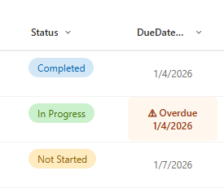

# Date Overdue Warning

## Summary

Displays a date field with an overdue warning indicator for incomplete tasks. Shows a prominent "⚠ Overdue" label with highlighted background when the date has passed and the associated task status is not "Completed".

## View requirements

|Type|Internal Name|Required|
|---|---|:---:|
|Date and Time|Any date column|Yes|
|Choice or Single line of text|Status|Yes|

## Version history

Version|Date|Comments
-------|----|--------
1.0|January 2026|Initial release

## Disclaimer

**THIS CODE IS PROVIDED *AS IS* WITHOUT WARRANTY OF ANY KIND, EITHER EXPRESS OR IMPLIED, INCLUDING ANY IMPLIED WARRANTIES OF FITNESS FOR A PARTICULAR PURPOSE, MERCHANTABILITY, OR NON-INFRINGEMENT.**

---

## Additional notes

### Features
- **Conditional warning display:** Only shows overdue alert when date has passed AND status is not "Completed"
- **Visual indicator:** Orange warning icon (⚠) with "Overdue" label
- **Highlighted background:** Orange-tinted background for overdue items
- **Smart formatting:** Regular display for non-overdue or completed items

### Requirements
This formatting requires a **Status** column with at least a "Completed" choice value. The Status column internal name must be exactly `Status`.

### Customization
You can customize the appearance:
- Warning background: `#fff7ed` (light orange)
- Warning text color: `#9a3412` (dark orange)
- Warning icon: `⚠` (can be changed to any emoji or text)
- Status value check: Currently checks for `'Completed'` (case-sensitive)

### Usage Tips
- Perfect for task lists, project timelines, or any deadline tracking
- Completed items will display normally even if past due date
- Future dates display normally without warning
- If your Status column uses different values (e.g., "Done", "Finished"), update the `!= 'Completed'` condition in the JSON

### Column Name Dependencies
⚠️ **Important:** This formatting references `[$Status]` which requires:
- A column with internal name exactly "Status"
- If your status column has a different internal name, replace all instances of `[$Status]` in the JSON

## References

- [Use column formatting to customize SharePoint](https://docs.microsoft.com/en-us/sharepoint/dev/declarative-customization/column-formatting)