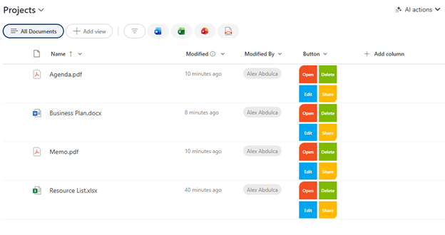

# Action Buttons Grid

## Summary

Displays a 2x2 grid of colorful action buttons (Open, Delete, Edit, Share) in a Microsoft brand color scheme. Provides quick access to common list item actions directly from the list view without needing to open the item menu.

## View requirements

|Type|Internal Name|Required|
|---|---|:---:|
|Any column type|Any column|Yes|

**Note:** This formatting can be applied to any column, though it's recommended to use a dedicated column (like "Actions" or "Quick Actions") for clarity.

## Version history

Version|Date|Comments
-------|----|--------
1.0|January 2026|Initial release

## Disclaimer

**THIS CODE IS PROVIDED *AS IS* WITHOUT WARRANTY OF ANY KIND, EITHER EXPRESS OR IMPLIED, INCLUDING ANY IMPLIED WARRANTIES OF FITNESS FOR A PARTICULAR PURPOSE, MERCHANTABILITY, OR NON-INFRINGEMENT.**

---

## Additional notes

### Features
- **Four action buttons** in a compact 2x2 grid layout
  - **Open** (Red): Opens the item in view mode
  - **Delete** (Green): Deletes the item (with confirmation)
  - **Edit** (Blue): Opens the item in edit mode
  - **Share** (Yellow): Opens the sharing dialog
- **Microsoft brand colors** for visual consistency
- **Rounded corners** on outer edges for a polished look
- **Fixed size** (84x84px) for consistent column width

### Customization
You can customize button colors, labels, and actions:
- Open button: `#f25022` (red)
- Delete button: `#7fba00` (green)
- Edit button: `#00a4ef` (blue)
- Share button: `#ffb900` (yellow)

### Available Actions
You can replace `customRowAction` values with:
- `defaultClick` - Opens item
- `delete` - Deletes item
- `editProps` - Edit item properties
- `share` - Share item
- `executeFlow` - Trigger a Power Automate flow (requires additional configuration)

### Usage Tips
- Best used in a dedicated "Actions" column (Single line of text)
- Set column width to at least 100px for proper display
- Consider user permissions - delete action requires appropriate permissions
- Delete action will prompt for confirmation before executing

### Layout Considerations
⚠️ **Note:** The fixed dimensions (84x84px) work well for standard list views but may need adjustment for:
- Mobile views (consider reducing button sizes)
- Compact list layouts
- Views with many columns

## References

- [Use column formatting to customize SharePoint](https://docs.microsoft.com/en-us/sharepoint/dev/declarative-customization/column-formatting)
- [Custom row actions](https://docs.microsoft.com/en-us/sharepoint/dev/declarative-customization/formatting-syntax-reference#customrowaction)