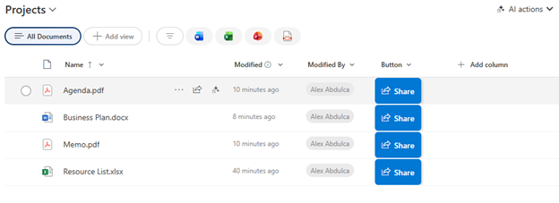

# Share Button

## Summary

Displays a clean, modern share button with an icon and label. Clicking the button opens SharePoint's native sharing dialog, allowing users to quickly share list items with others directly from the list view.

## View requirements

|Type|Internal Name|Required|
|---|---|:---:|
|Any column type|Any column|Yes|

**Note:** This formatting can be applied to any column, though it's recommended to use a dedicated column (like "Share" or "Actions") for clarity.

## Version history

Version|Date|Comments
-------|----|--------
1.0|January 2026|Initial release

## Disclaimer

**THIS CODE IS PROVIDED *AS IS* WITHOUT WARRANTY OF ANY KIND, EITHER EXPRESS OR IMPLIED, INCLUDING ANY IMPLIED WARRANTIES OF FITNESS FOR A PARTICULAR PURPOSE, MERCHANTABILITY, OR NON-INFRINGEMENT.**

---

## Additional notes

### Features
- **Fluent UI share icon** for familiar Microsoft experience
- **Button label** with "Share" text
- **Hover effects** with shadow for depth
- **Rounded corners** for modern appearance
- **Accessible** with proper title attribute for screen readers

### Customization
You can customize the button appearance:
- Background color: `#0078D4` (Microsoft blue)
- Button text: Change `"Share"` to any label
- Icon: Change `"Share"` to any [Fluent UI icon name](https://uifabricicons.azurewebsites.net/)
- Padding and spacing can be adjusted in the style properties

### Usage Tips
- Best used in a dedicated column (Single line of text or Choice)
- Requires appropriate sharing permissions for the list/library
- Opens the native SharePoint sharing dialog
- Works with both list items and documents

### Alternative Icons
You can replace the Share icon with other relevant Fluent UI icons:
- `"ShareiOS"` - iOS-style share icon
- `"People"` - For user collaboration focus
- `"Link"` - For link sharing emphasis
- `"Mail"` - For email sharing emphasis

### Permissions
⚠️ **Note:** The share functionality respects SharePoint permissions. Users without sharing permissions will see the button but may receive an error when clicking it.

## References

- [Use column formatting to customize SharePoint](https://docs.microsoft.com/en-us/sharepoint/dev/declarative-customization/column-formatting)
- [Custom row actions](https://docs.microsoft.com/en-us/sharepoint/dev/declarative-customization/formatting-syntax-reference#customrowaction)
- [Fluent UI Icons](https://uifabricicons.azurewebsites.net/)