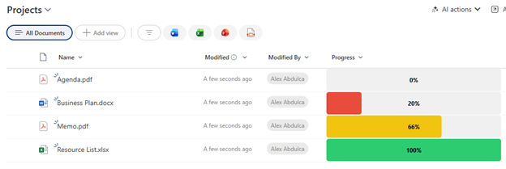

# Progress Bar with Percentage

## Summary

Displays a number field as a visual progress bar with color-coded status indicators. The bar changes color based on completion percentage: red for low progress (≤30%), yellow for medium progress (31-70%), and green for high progress (>70%). The percentage value is displayed centered on the bar.



## View requirements

|Type|Internal Name|Required|
|---|---|:---:|
|Number|Any number column|Yes|

**Note:** The number field should contain values between 0-100 representing percentages.

## Version history

Version|Date|Comments
-------|----|--------
1.0|January 2026|Initial release

## Disclaimer

**THIS CODE IS PROVIDED *AS IS* WITHOUT WARRANTY OF ANY KIND, EITHER EXPRESS OR IMPLIED, INCLUDING ANY IMPLIED WARRANTIES OF FITNESS FOR A PARTICULAR PURPOSE, MERCHANTABILITY, OR NON-INFRINGEMENT.**

---

## Additional notes

### Features
- **Visual progress indicator** with dynamic width based on value
- **Color-coded status:**
  - Red (`#e74c3c`): 0-30% (Low progress)
  - Yellow (`#f1c40f`): 31-70% (Medium progress)
  - Green (`#2ecc71`): 71-100% (High progress)
- **Centered percentage label** displayed on the bar
- **Rounded corners** for modern appearance
- **Gray background** to show remaining progress

### Customization
You can customize colors and thresholds:
- Low progress color: `#e74c3c` (red)
- Medium progress color: `#f1c40f` (yellow)
- High progress color: `#2ecc71` (green)
- Background color: `#f0f0f0` (light gray)
- Thresholds: Currently set at 30% and 70% (can be adjusted in the condition)

### Usage Tips
- Ideal for tracking task completion, project status, or KPI metrics
- Values should be between 0-100
- Values over 100 will extend beyond the bar width
- Consider adding number validation to your column (min: 0, max: 100)

### Threshold Customization
To change when colors switch, modify these values in the JSON:
```json
"=if(@currentField <= 30, '#e74c3c', if(@currentField <= 70, '#f1c40f', '#2ecc71'))"
```
- First number (30): Low to medium threshold
- Second number (70): Medium to high threshold

### Best Practices
- Use with Number columns formatted to show 0 decimal places
- Set column width to at least 100px for proper display
- Ensure data validation prevents negative numbers or values over 100

## References

- [Use column formatting to customize SharePoint](https://docs.microsoft.com/en-us/sharepoint/dev/declarative-customization/column-formatting)