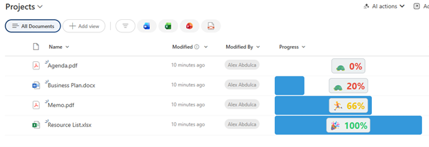

# Progress Bar with Emoji Indicators

## Summary

Displays a number field as an animated progress bar with fun emoji indicators that change based on progress level. Shows a turtle (🐢) for slow progress, a walking person (🚶) for moderate progress, a running person (🏃) for good progress, and a celebration (🎉) for 100% completion. The percentage text color also changes to reflect status.



## View requirements

|Type|Internal Name|Required|
|---|---|:---:|
|Number|Any number column|Yes|

**Note:** The number field should contain values between 0-100 representing percentages.

## Version history

Version|Date|Comments
-------|----|--------
1.0|January 2026|Initial release

## Disclaimer

**THIS CODE IS PROVIDED *AS IS* WITHOUT WARRANTY OF ANY KIND, EITHER EXPRESS OR IMPLIED, INCLUDING ANY IMPLIED WARRANTIES OF FITNESS FOR A PARTICULAR PURPOSE, MERCHANTABILITY, OR NON-INFRINGEMENT.**

---

## Additional notes

### Features
- **Animated progress bar** with smooth width transition
- **Dynamic emoji indicators:**
  - 🐢 (Turtle): 0-20% - Just starting
  - 🚶 (Walking): 21-60% - Making progress
  - 🏃 (Running): 61-99% - Almost there
  - 🎉 (Celebration): 100% - Complete!
- **Color-coded percentage text:**
  - Red: 0-30% (Low progress)
  - Yellow: 31-70% (Medium progress)
  - Green: 71-100% (High progress)
- **Pill-shaped label** with background and border
- **Centered display** over the progress bar

### Customization
You can customize colors, emojis, and thresholds:
- Progress bar color: `#3498db` (blue)
- Label background: `#ecf0f1` (light gray)
- Label border: `#bdc3c7` (gray)
- Text colors: 
  - Low: `#e74c3c` (red)
  - Medium: `#f1c40f` (yellow)
  - High: `#2ecc71` (green)

### Emoji Thresholds
Current emoji breakpoints:
- 🐢 Turtle: 0-20%
- 🚶 Walking: 21-60%
- 🏃 Running: 61-99%
- 🎉 Celebration: 100%

### Usage Tips
- Perfect for gamified task tracking, project milestones, or goal completion
- Values should be between 0-100
- The celebration emoji (🎉) only appears at exactly 100%
- Column width recommendation: 150-200px for comfortable display

### Customizing Emojis
You can replace emojis to match your theme:
```json
"=if(@currentField == 100, '✅', if(@currentField >= 61, '⚡', if(@currentField >= 21, '📊','⏳')))"
```
Examples: ✅ ⚡ 📊 ⏳ 🎯 🔥 ⭐ 💪 🚀

## References

- [Use column formatting to customize SharePoint](https://docs.microsoft.com/en-us/sharepoint/dev/declarative-customization/column-formatting)