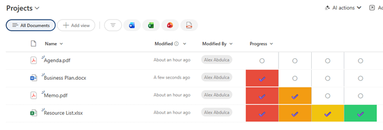

# Progress Steps Indicator

## Summary

Displays a number field as a visual step-by-step progress indicator with four milestones at 25%, 50%, 75%, and 100%. Each completed step is highlighted with a checkmark and color fill, while incomplete steps show an empty circle. Perfect for tracking multi-stage processes or phased project completion.

## View requirements

|Type|Internal Name|Required|
|---|---|:---:|
|Number|Any number column|Yes|

**Note:** The number field should contain values between 0-100 representing percentages.

## Version history

Version|Date|Comments
-------|----|--------
1.0|January 2026|Initial release

## Disclaimer

**THIS CODE IS PROVIDED *AS IS* WITHOUT WARRANTY OF ANY KIND, EITHER EXPRESS OR IMPLIED, INCLUDING ANY IMPLIED WARRANTIES OF FITNESS FOR A PARTICULAR PURPOSE, MERCHANTABILITY, OR NON-INFRINGEMENT.**

---

## Additional notes

### Features
- **Four-step milestone tracker** at 25%, 50%, 75%, and 100%
- **Visual progress indicators:**
  - ✔️ Checkmark: Step completed
  - ○ Empty circle: Step not yet reached
- **Color-coded steps:**
  - Step 1 (25%): Red (`#e74c3c`)
  - Step 2 (50%): Orange (`#f39c12`)
  - Step 3 (75%): Yellow (`#f1c40f`)
  - Step 4 (100%): Green (`#2ecc71`)
- **Equal-width segments** with dividing borders
- **Responsive design** adapts to column width

### How It Works
- Values 0-24%: No steps completed
- Values 25-49%: First step completed (red)
- Values 50-74%: First two steps completed (red + orange)
- Values 75-99%: First three steps completed (red + orange + yellow)
- Value 100%: All steps completed (red + orange + yellow + green)

### Customization
You can customize colors, milestones, and indicators:
- Step colors can be changed for each segment
- Milestone thresholds (currently 25, 50, 75, 100) can be adjusted
- Checkmark `✔️` can be replaced with other indicators like `✓`, `●`, or custom emojis
- Empty circle `○` can be changed to `◯`, `-`, or other placeholders

### Usage Tips
- Ideal for project phases, approval workflows, or multi-stage processes
- Values should be between 0-100
- Consider labeling your steps (e.g., "Planning (25%), Execution (50%), Review (75%), Complete (100%)")
- Column width recommendation: 150-250px for comfortable display

### Adapting for Different Numbers of Steps
To add or remove steps:
1. Add/remove child divs in the `children` array
2. Adjust the threshold values (e.g., for 5 steps: 20, 40, 60, 80, 100)
3. Update colors as needed
4. For 3 steps example: thresholds would be 33, 66, 100

### Alternative Indicators
Replace checkmark and circle with other symbols:
- Numbers: `1`, `2`, `3`, `4`
- Emojis: `🎯`, `⭐`, `🏆`, `🎉`
- Icons: `●`, `■`, `▲`, `♦`

## References

- [Use column formatting to customize SharePoint](https://docs.microsoft.com/en-us/sharepoint/dev/declarative-customization/column-formatting)