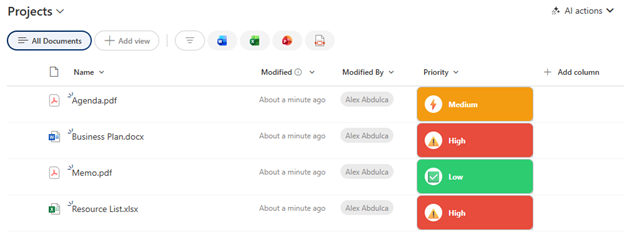

# Priority Badge with Icons

## Summary

Displays a choice or text field as a visually prominent priority badge with color-coded backgrounds and matching icons. Shows High (red with warning), Medium (orange with lightning), and Low (green with checkmark) priority levels in a polished, professional style with shadows and rounded corners.



## View requirements

|Type|Internal Name|Required|
|---|---|:---:|
|Choice or Single line of text|Any column|Yes|

**Note:** The column should contain values: "High", "Medium", or "Low" (case-sensitive).

## Version history

Version|Date|Comments
-------|----|--------
1.0|January 2026|Initial release

## Disclaimer

**THIS CODE IS PROVIDED *AS IS* WITHOUT WARRANTY OF ANY KIND, EITHER EXPRESS OR IMPLIED, INCLUDING ANY IMPLIED WARRANTIES OF FITNESS FOR A PARTICULAR PURPOSE, MERCHANTABILITY, OR NON-INFRINGEMENT.**

---

## Additional notes

### Features
- **Color-coded priority badges:**
  - High: Red (`#e74c3c`) with ⚠️ warning icon
  - Medium: Orange (`#f39c12`) with ⚡ lightning icon
  - Low: Green (`#2ecc71`) with ✅ checkmark icon
- **Circular icon container** with white background
- **Professional styling** with shadow and border
- **Fixed minimum width** for consistent alignment
- **White text** on colored background for high contrast

### Requirements
This formatting expects **exact text values**:
- `High` (case-sensitive)
- `Medium` (case-sensitive)
- `Low` (case-sensitive)

If your choice column uses different values, update the JSON accordingly.

### Customization
You can customize colors, icons, and styling:
- High priority color: `#e74c3c` (red)
- Medium priority color: `#f39c12` (orange)
- Low priority color: `#2ecc71` (green)
- Border color: `#bdc3c7` (gray)
- Icon emojis can be changed:
  - High: `⚠️` → `🔴`, `❗`, `🚨`
  - Medium: `⚡` → `⚠️`, `🔶`, `⏰`
  - Low: `✅` → `✓`, `🟢`, `👍`

### Usage Tips
- Best used with a **Choice** column with three options: High, Medium, Low
- Column width recommendation: 180-200px
- Ensure choice values match exactly (case-sensitive)
- Works well in task lists, issue trackers, or any prioritized content

### Adding More Priority Levels
To support additional levels (e.g., "Critical", "Urgent"):
1. Extend the conditional logic in both `background-color` and icon sections
2. Add corresponding colors and icons
3. Update the choice column to include new values

Example for "Critical":
```json
"=if(@currentField == 'Critical', '#c0392b', if(@currentField == 'High', '#e74c3c', ...))"
```

### Case Sensitivity Warning
⚠️ **Important:** The formatting is case-sensitive. "high", "HIGH", or "High " (with space) will not match and will default to the Low (green) styling.

### Alternative Choice Values
If your organization uses different terminology:
- Replace `'High'` with `'P1'` or `'Urgent'`
- Replace `'Medium'` with `'P2'` or `'Normal'`
- Replace `'Low'` with `'P3'` or `'Minor'`

## References

- [Use column formatting to customize SharePoint](https://docs.microsoft.com/en-us/sharepoint/dev/declarative-customization/column-formatting)