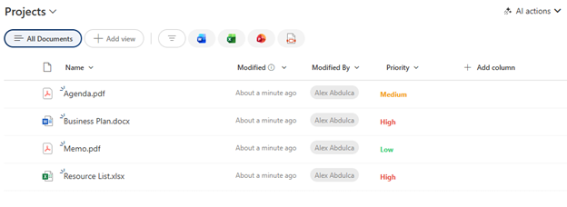

# Simple Priority Text Color

## Summary

Displays a choice or text field with color-coded text based on priority level. A minimal, lightweight formatting option that applies bold styling and priority-based colors (red for High, orange for Medium, green for Low) without any additional visual elements.



## View requirements

|Type|Internal Name|Required|
|---|---|:---:|
|Choice or Single line of text|Any column|Yes|

**Note:** The column should contain values: "High", "Medium", or "Low" (case-sensitive).

## Version history

Version|Date|Comments
-------|----|--------
1.0|January 2026|Initial release

## Disclaimer

**THIS CODE IS PROVIDED *AS IS* WITHOUT WARRANTY OF ANY KIND, EITHER EXPRESS OR IMPLIED, INCLUDING ANY IMPLIED WARRANTIES OF FITNESS FOR A PARTICULAR PURPOSE, MERCHANTABILITY, OR NON-INFRINGEMENT.**

---

## Additional notes

### Features
- **Minimal design** - just colored text, no backgrounds or icons
- **Color-coded priorities:**
  - High: Red (`#e74c3c`)
  - Medium: Orange (`#f39c12`)
  - Low: Green (`#2ecc71`)
- **Bold text** for emphasis
- **Lightweight** - no impact on column width or layout
- **Quick to scan** in lists with many items

### Requirements
This formatting expects **exact text values**:
- `High` (case-sensitive)
- `Medium` (case-sensitive)
- `Low` (case-sensitive)

If your choice column uses different values, update the JSON accordingly.

### Customization
You can customize colors:
- High priority color: `#e74c3c` (red)
- Medium priority color: `#f39c12` (orange)
- Low priority color: `#2ecc71` (green)

To remove bold styling, delete the `"font-weight": "bold"` line.

### Usage Tips
- Perfect for compact views where space is limited
- Ideal when you want priority indication without visual clutter
- Works well when combined with other column formatting
- Best used with a **Choice** column with three options: High, Medium, Low
- No minimum column width required

### When to Use This vs. Priority Badge
**Use Simple Priority Text when:**
- You need a minimal, clean look
- Column space is limited
- You have many columns and want to reduce visual noise
- Text color alone provides sufficient emphasis

**Use Priority Badge (text-priority-badge) when:**
- You want maximum visual impact
- Icons help users quickly identify priority
- You have adequate column width
- The column is a primary focus point

### Case Sensitivity Warning
⚠️ **Important:** The formatting is case-sensitive. "high", "HIGH", or "High " (with space) will not match and will default to the Low (green) color.

### Alternative Choice Values
If your organization uses different terminology, replace the values:
- Replace `'High'` with `'P1'` or `'Urgent'`
- Replace `'Medium'` with `'P2'` or `'Normal'`
- Replace `'Low'` with `'P3'` or `'Minor'`

### Adding More Priority Levels
To support additional levels:
```json
"color": "=if(@currentField == 'Critical', '#c0392b', if(@currentField == 'High', '#e74c3c', if(@currentField == 'Medium', '#f39c12', '#2ecc71')))"
```

## References

- [Use column formatting to customize SharePoint](https://docs.microsoft.com/en-us/sharepoint/dev/declarative-customization/column-formatting)