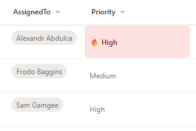

# Priority with User Assignment Highlight

## Summary

Displays a priority field with special highlighting for high-priority items assigned to the current user. When a task is marked as "High" priority AND assigned to you, it appears with a red background, bold text, and a fire emoji to draw immediate attention. Other priorities display normally without special formatting.



## View requirements

|Type|Internal Name|Required|
|---|---|:---:|
|Choice or Single line of text|Any column (Priority)|Yes|
|Person or Group|AssignedTo|Yes|

**Note:** The priority column should contain text values including "High". The Person column internal name must be exactly `AssignedTo`.

## Version history

Version|Date|Comments
-------|----|--------
1.0|January 2026|Initial release

## Disclaimer

**THIS CODE IS PROVIDED *AS IS* WITHOUT WARRANTY OF ANY KIND, EITHER EXPRESS OR IMPLIED, INCLUDING ANY IMPLIED WARRANTIES OF FITNESS FOR A PARTICULAR PURPOSE, MERCHANTABILITY, OR NON-INFRINGEMENT.**

---

## Additional notes

### Features
- **Personalized highlighting** - only highlights items assigned to YOU
- **High priority alert** with fire emoji (🔥) for your assigned items
- **Visual distinction:**
  - Your high-priority items: Red background (`#fee2e2`), dark red text (`#991b1b`), bold, with 🔥 emoji
  - All other items: Normal display without special formatting
- **Context-aware** - uses `@me` to check current user

### Requirements
This formatting requires:
1. A priority column with at least a "High" value (case-sensitive)
2. A **Person or Group** column with internal name exactly `AssignedTo`
3. The Person column must allow a single user selection

### Customization
You can customize the highlight appearance:
- Background color: `#fee2e2` (light red)
- Text color: `#991b1b` (dark red)
- Emoji: `🔥` → `⚠️`, `🚨`, `❗`, `⭐`
- Priority value: Change `'High'` to match your terminology

### Usage Tips
- Perfect for personal task lists or team boards where you want YOUR high-priority items to stand out
- Helps users quickly identify what needs their immediate attention
- Other team members see the same list but only THEIR high-priority assignments are highlighted
- Works great in "My Tasks" or "Assigned to Me" views

### Column Name Dependencies
⚠️ **Important:** This formatting references `[$AssignedTo.email]` which requires:
- A Person column with internal name exactly "AssignedTo"
- If your person column has a different internal name (e.g., "Owner", "Responsible"), replace all instances of `[$AssignedTo.email]` in the JSON

To find your column's internal name:
1. Go to List Settings → Click on the column
2. Check the URL for `Field=` parameter
3. Use that exact name in the formatting

### Extending to Other Priority Levels
To highlight medium-priority items differently:
```json
"background-color": "=if(@currentField == 'High' && @me == [$AssignedTo.email], '#fee2e2', if(@currentField == 'Medium' && @me == [$AssignedTo.email], '#fef3c7', ''))"
```

### Alternative: Highlight All Your Assignments
To highlight ALL items assigned to you (regardless of priority):
```json
"background-color": "=if(@me == [$AssignedTo.email], '#dbeafe', '')"
```

### Case Sensitivity Warning
⚠️ **Important:** The priority value comparison is case-sensitive. "high", "HIGH", or "High " (with space) will not trigger the highlighting.

## References

- [Use column formatting to customize SharePoint](https://docs.microsoft.com/en-us/sharepoint/dev/declarative-customization/column-formatting)
- [Using @me in column formatting](https://docs.microsoft.com/en-us/sharepoint/dev/declarative-customization/formatting-syntax-reference#me)