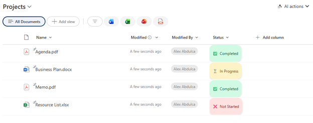

# Status Pill with Icons

## Summary

Displays a choice or text field as a colorful pill-shaped badge with status icons. Shows Completed (green with checkmark), In Progress (yellow with hourglass), and a default state (red with X) in a modern, polished style with shadows and rounded edges.



## View requirements

|Type|Internal Name|Required|
|---|---|:---:|
|Choice or Single line of text|Any column|Yes|

**Note:** The column works best with values: "Completed", "In Progress", or any other status (case-sensitive).

## Version history

Version|Date|Comments
-------|----|--------
1.0|January 2026|Initial release

## Disclaimer

**THIS CODE IS PROVIDED *AS IS* WITHOUT WARRANTY OF ANY KIND, EITHER EXPRESS OR IMPLIED, INCLUDING ANY IMPLIED WARRANTIES OF FITNESS FOR A PARTICULAR PURPOSE, MERCHANTABILITY, OR NON-INFRINGEMENT.**

---

## Additional notes

### Features
- **Pill-shaped badges** with rounded corners
- **Status-specific styling:**
  - Completed: Green background (`#d1fae5`) with dark green text (`#065f46`) and ✅ checkmark
  - In Progress: Yellow background (`#fef3c7`) with dark brown text (`#92400e`) and ⏳ hourglass
  - Other/Not Started: Red background (`#fee2e2`) with dark red text (`#991b1b`) and ❌ X mark
- **Icon + text combination** for clear visual communication
- **Subtle shadow** for depth and separation
- **Inline display** that adapts to content width

### Requirements
This formatting expects these **exact text values** (case-sensitive):
- `Completed`
- `In Progress`
- Any other value will default to the red "not started" styling

### Customization
You can customize colors, icons, and status values:

**Colors:**
- Completed background: `#d1fae5` (light green), text: `#065f46` (dark green)
- In Progress background: `#fef3c7` (light yellow), text: `#92400e` (dark brown)
- Default background: `#fee2e2` (light red), text: `#991b1b` (dark red)

**Icons:**
- Completed: `✅` → `✓`, `🎉`, `✔️`, `👍`
- In Progress: `⏳` → `⚙️`, `🔄`, `⏱️`, `▶️`
- Default: `❌` → `⭕`, `🔴`, `❗`, `⚠️`

### Usage Tips
- Best used with a **Choice** column with predefined status values
- Recommended column width: 150-200px
- Works well for task status, project phases, approval states
- Consider using specific statuses instead of the generic "default" (e.g., "Not Started", "Blocked", "Cancelled")

### Adding More Status Values
To support additional statuses (e.g., "On Hold", "Blocked"):
```json
"background-color": "=if(@currentField == 'Completed', '#d1fae5', if(@currentField == 'In Progress', '#fef3c7', if(@currentField == 'On Hold', '#e0e7ff', '#fee2e2')))"
```

Example additional statuses:
- **On Hold:** Background `#e0e7ff` (light blue), text `#3730a3` (dark blue), icon `⏸️`
- **Blocked:** Background `#fef3c7` (light orange), text `#78350f` (dark orange), icon `🚫`
- **Cancelled:** Background `#f3f4f6` (light gray), text `#374151` (dark gray), icon `🚫`

### Common Status Terminology Sets
**Option 1 - Task Workflow:**
- Not Started, In Progress, Completed, Blocked

**Option 2 - Approval Process:**
- Pending, Under Review, Approved, Rejected

**Option 3 - Development:**
- Backlog, In Development, Testing, Deployed

### Case Sensitivity Warning
⚠️ **Important:** Status values are case-sensitive. "completed", "COMPLETED", or "Completed " (with space) will not match and will default to the red styling.

### Alternative: Simple Two-State Toggle
For a simple done/not done indicator:
```json
"=if(@currentField == 'Completed', '#d1fae5', '#e5e7eb')"
```

## References

- [Use column formatting to customize SharePoint](https://docs.microsoft.com/en-us/sharepoint/dev/declarative-customization/column-formatting)