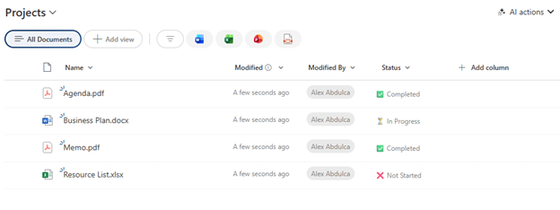

# Simple Status with Icons

## Summary

Displays a choice or text field with status icons prefixed to the text. A minimal, lightweight formatting option that adds visual indicators (checkmark for Completed, hourglass for In Progress, X for Not Started) without any backgrounds, colors, or additional styling.



## View requirements

|Type|Internal Name|Required|
|---|---|:---:|
|Choice or Single line of text|Any column|Yes|

**Note:** The column works best with values: "Completed", "In Progress", or any other status (case-sensitive).

## Version history

Version|Date|Comments
-------|----|--------
1.0|January 2026|Initial release

## Disclaimer

**THIS CODE IS PROVIDED *AS IS* WITHOUT WARRANTY OF ANY KIND, EITHER EXPRESS OR IMPLIED, INCLUDING ANY IMPLIED WARRANTIES OF FITNESS FOR A PARTICULAR PURPOSE, MERCHANTABILITY, OR NON-INFRINGEMENT.**

---

## Additional notes

### Features
- **Ultra-minimal design** - just icons and text, no styling
- **Status icons:**
  - Completed: ✅ with "Completed" label
  - In Progress: ⏳ with "In Progress" label
  - Other: ❌ with "Not Started" label
- **No impact on layout** - works in any column width
- **Lightweight** - fastest rendering performance
- **Clean and readable** in compact views

### Requirements
This formatting expects these **exact text values** (case-sensitive):
- `Completed`
- `In Progress`
- Any other value displays as "❌ Not Started"

### Customization
You can customize icons and labels:

**Icons:**
- Completed: `✅` → `✓`, `🎉`, `✔️`, `👍`, `🟢`
- In Progress: `⏳` → `⚙️`, `🔄`, `⏱️`, `▶️`, `🟡`
- Not Started: `❌` → `⭕`, `🔴`, `❗`, `⚠️`, `🔵`

**Labels:**
Replace the text after icons to match your terminology:
- `'✅ Completed'` → `'✅ Done'`
- `'⏳ In Progress'` → `'⏳ Active'`
- `'❌ Not Started'` → `'❌ Pending'`

### Usage Tips
- Perfect for compact views where space is critical
- Ideal when you want status indication without visual clutter
- Works well in lists with many columns
- No minimum column width required
- Great for mobile-responsive views

### When to Use This vs. Status Pill
**Use Simple Status with Icons when:**
- You need a minimal, clean look
- Column space is very limited
- You have many columns and want to reduce visual noise
- Quick scanning is more important than visual impact
- Performance is a priority (minimal CSS)

**Use Status Pill (text-status-pill) when:**
- You want maximum visual distinction
- Color-coding helps users identify status quickly
- You have adequate column width
- The status column is a primary focus

### Adding More Status Values
To support additional statuses:
```json
"txtContent": "=if(@currentField == 'Completed', '✅ Completed', if(@currentField == 'In Progress', '⏳ In Progress', if(@currentField == 'On Hold', '⏸️ On Hold', '❌ Not Started')))"
```

### Icon-Only Version
For even more minimal display (just icons, no text):
```json
"txtContent": "=if(@currentField == 'Completed', '✅', if(@currentField == 'In Progress', '⏳', '❌'))"
```

### Common Status Terminology Sets
**Option 1 - Task Workflow:**
- ❌ Not Started, ⏳ In Progress, ✅ Completed, 🚫 Blocked

**Option 2 - Approval Process:**
- ⏳ Pending, 👀 Under Review, ✅ Approved, ❌ Rejected

**Option 3 - Development:**
- 📋 Backlog, 💻 In Development, 🧪 Testing, 🚀 Deployed

### Case Sensitivity Warning
⚠️ **Important:** Status values are case-sensitive. "completed", "COMPLETED", or "Completed " (with space) will not match and will default to "❌ Not Started".

## References

- [Use column formatting to customize SharePoint](https://docs.microsoft.com/en-us/sharepoint/dev/declarative-customization/column-formatting)