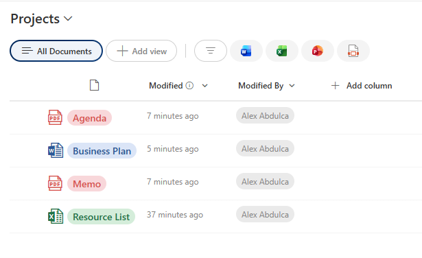

# File Type Icon with Title Badge

## Summary

Displays a file title with a color-coded file type icon and a matching pill-shaped badge containing the filename (without extension). Automatically detects common file types (PDF, Word, Excel, PowerPoint, Images) and applies appropriate Microsoft Office-style icons and colors for quick visual identification.



## View requirements

|Type|Internal Name|Required|
|---|---|:---:|
|Single line of text or Title|FileLeafRef|Yes|

**Note:** This formatting is designed for document libraries where `FileLeafRef` contains the full filename with extension. For custom list columns, replace `[$FileLeafRef]` with your column's internal name.

## Version history

Version|Date|Comments
-------|----|--------
1.0|January 2026|Initial release

## Disclaimer

**THIS CODE IS PROVIDED *AS IS* WITHOUT WARRANTY OF ANY KIND, EITHER EXPRESS OR IMPLIED, INCLUDING ANY IMPLIED WARRANTIES OF FITNESS FOR A PARTICULAR PURPOSE, MERCHANTABILITY, OR NON-INFRINGEMENT.**

---

## Additional notes

### Features
- **Automatic file type detection** based on extension
- **Microsoft Office-style icons** using Fluent UI:
  - PDF: Red PDF icon
  - Word (.docx): Blue WordDocument icon
  - Excel (.xlsx): Green ExcelDocument icon
  - PowerPoint (.pptx): Orange PowerPointDocument icon
  - Images (.jpg, .png, .gif): Yellow Picture icon
  - Other files: Gray Page icon
- **Color-coded badges** matching file type
- **Filename display** without extension in a pill-shaped badge
- **Tooltip** showing full file type description
- **Text truncation** with ellipsis for long filenames

### Supported File Types
Currently detects these extensions:
- `.pdf` - PDF files (red)
- `.docx` - Word documents (blue)
- `.xlsx` - Excel spreadsheets (green)
- `.pptx` - PowerPoint presentations (orange)
- `.jpg`, `.png`, `.gif` - Image files (yellow)
- Other - Generic file (gray)

### Color Scheme
**Icons and text:**
- PDF: `#d9534f` (red)
- Word: `#2b5797` (blue)
- Excel: `#217346` (green)
- PowerPoint: `#d46a00` (orange)
- Images: `#f0ad4e` (yellow)
- Other: `#6c757d` (gray) / `#333` (text)

**Badge backgrounds:**
- PDF: `#f8d7da` (light red)
- Word: `#dbe5f7` (light blue)
- Excel: `#d4edda` (light green)
- PowerPoint: `#fff3cd` (light yellow)
- Images: `#fff0d6` (light beige)
- Other: `#e1e1e1` (light gray)

### Usage Tips
- Best used in document libraries on the Title or Name column
- Works well in list views showing multiple file types
- Icon size (22px) is optimized for standard row heights
- Filename truncation prevents layout issues with long names

### Adding More File Types
To support additional extensions (e.g., `.zip`, `.txt`, `.csv`):

1. Add to icon name condition:
```json
if(endsWith([$FileLeafRef], '.zip'), 'ZipFolder', ...)
```

2. Add to color condition:
```json
if(endsWith([$FileLeafRef], '.zip'), '#9c27b0', ...)
```

3. Add to background color condition:
```json
if(endsWith([$FileLeafRef], '.zip'), '#f3e5f5', ...)
```

**Example additions:**
- `.zip`: Icon: `ZipFolder`, Color: `#9c27b0` (purple)
- `.txt`: Icon: `TextDocument`, Color: `#607d8b` (blue-gray)
- `.csv`: Icon: `ExcelDocument`, Color: `#217346` (green, same as Excel)

### Column Name Dependencies
⚠️ **Important:** This formatting references `[$FileLeafRef]` which is:
- The standard internal name for the filename in document libraries
- For custom lists with text columns containing filenames, replace all instances of `[$FileLeafRef]` with your column's internal name
- Must contain the full filename including extension

### Customization for Non-Document Libraries
If using in a regular list with a custom filename column:
1. Create a Single line of text column (e.g., "FileName")
2. Replace all `[$FileLeafRef]` with `[$FileName]` in the JSON
3. Ensure users enter filenames with extensions

### Available Fluent UI Icons
Other useful file type icons you can use:
- `Code` - For code files (.js, .html, .css)
- `FileCode` - Alternative code icon
- `Video` - For video files (.mp4, .avi)
- `Music` - For audio files (.mp3, .wav)
- `Folder` - For folder indicators
- `Archive` - For compressed files

See all icons: [Fluent UI Icons](https://uifabricicons.azurewebsites.net/)

## References

- [Use column formatting to customize SharePoint](https://docs.microsoft.com/en-us/sharepoint/dev/declarative-customization/column-formatting)
- [Fluent UI Icons](https://uifabricicons.azurewebsites.net/)