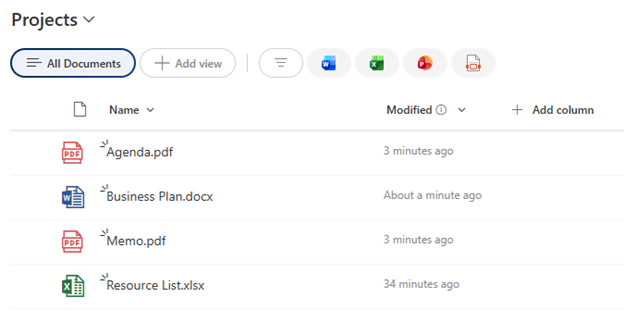

# Simple File Type Icon

## Summary

Displays a color-coded file type icon based on the file extension. A minimal, lightweight formatting option that shows only the icon (no text or badges) for common file types including PDF, Word, Excel, and other documents.



## View requirements

|Type|Internal Name|Required|
|---|---|:---:|
|Single line of text or Title|FileLeafRef|Yes|

**Note:** This formatting is designed for document libraries where `FileLeafRef` contains the full filename with extension. For custom list columns, replace `[$FileLeafRef]` with your column's internal name.

## Version history

Version|Date|Comments
-------|----|--------
1.0|January 2026|Initial release

## Disclaimer

**THIS CODE IS PROVIDED *AS IS* WITHOUT WARRANTY OF ANY KIND, EITHER EXPRESS OR IMPLIED, INCLUDING ANY IMPLIED WARRANTIES OF FITNESS FOR A PARTICULAR PURPOSE, MERCHANTABILITY, OR NON-INFRINGEMENT.**

---

## Additional notes

### Features
- **Icon-only display** - minimal, clean look
- **Automatic file type detection** based on extension
- **Microsoft Office-style icons** using Fluent UI:
  - PDF: Red PDF icon (`#d9534f`)
  - Word (.docx): Blue WordDocument icon (`#2b5797`)
  - Excel (.xlsx): Green ExcelDocument icon (`#217346`)
  - Other files: Gray TextDocument icon (`#6c757d`)
- **24px icon size** for clear visibility
- **No additional styling** - works in any column width

### Supported File Types
Currently detects these extensions:
- `.pdf` - Red PDF icon
- `.docx` - Blue Word icon
- `.xlsx` - Green Excel icon
- Other - Gray generic document icon

### Usage Tips
- Perfect for compact views or narrow columns
- Ideal when file names are displayed in adjacent columns
- Works well when space is limited
- Best used in document libraries on a dedicated icon column
- Recommended column width: 40-60px

### When to Use This vs. Full Badge Version
**Use Simple File Type Icon when:**
- You need minimal visual space
- File names are shown in another column
- You want a clean, icon-only indicator
- Column width is constrained
- You prefer a minimalist design

**Use File Type Icon with Title Badge (text-title-filetype-icon) when:**
- You want filename displayed with the icon
- You have adequate column width (150-250px)
- You want maximum visual information
- The column serves as the primary file identifier

### Adding More File Types
To support additional extensions:
```json
"iconName": "=if(endsWith([$FileLeafRef], '.pdf'), 'PDF', if(endsWith([$FileLeafRef], '.docx'), 'WordDocument', if(endsWith([$FileLeafRef], '.xlsx'), 'ExcelDocument', if(endsWith([$FileLeafRef], '.pptx'), 'PowerPointDocument', 'TextDocument'))))"
```

**Suggested additions:**
- `.pptx` - PowerPoint: Icon `PowerPointDocument`, Color `#d46a00` (orange)
- `.zip` - Compressed: Icon `ZipFolder`, Color `#9c27b0` (purple)
- `.jpg/.png` - Images: Icon `Picture`, Color `#f0ad4e` (yellow)
- `.txt` - Text: Icon `TextDocument`, Color `#607d8b` (blue-gray)
- `.msg` - Email: Icon `Mail`, Color `#0078d4` (blue)

### Column Name Dependencies
⚠️ **Important:** This formatting references `[$FileLeafRef]` which is:
- The standard internal name for filenames in document libraries
- For custom lists, replace all instances of `[$FileLeafRef]` with your column's internal name
- Must contain the full filename including extension

### Customization Options
**Increase icon size:**
```json
"font-size": "32px"
```

**Remove spacing:**
```json
"margin-right": "0px"
```

**Center the icon:**
```json
"display": "flex",
"justify-content": "center"
```

### Alternative: Show Extension Badge
For a hybrid approach showing just the extension:
```json
"txtContent": "=toUpper(substring([$FileLeafRef], indexOf([$FileLeafRef], '.') + 1, length([$FileLeafRef])))"
```
This would display: PDF, DOCX, XLSX, etc.

### Available Fluent UI Icons
Other useful file type icons:
- `Code` - For code files
- `Video` - For video files
- `Music` - For audio files
- `Archive` - For compressed files
- `FileCode` - Alternative code icon
- `Contact` - For contact cards

See all icons: [Fluent UI Icons](https://uifabricicons.azurewebsites.net/)

## References

- [Use column formatting to customize SharePoint](https://docs.microsoft.com/en-us/sharepoint/dev/declarative-customization/column-formatting)
- [Fluent UI Icons](https://uifabricicons.azurewebsites.net/)