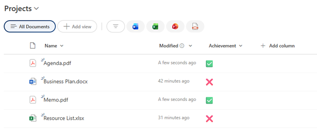

# Yes/No Checkmark Indicator

## Summary

Displays a Yes/No field as a simple visual indicator with a green checkmark (✅) for Yes and a red X mark (❌) for No. A minimal, easy-to-scan format perfect for quick status checks, completion tracking, or binary state displays.



## View requirements

|Type|Internal Name|Required|
|---|---|:---:|
|Yes/No (Boolean)|Any column|Yes|

## Version history

Version|Date|Comments
-------|----|--------
1.0|January 2026|Initial release

## Disclaimer

**THIS CODE IS PROVIDED *AS IS* WITHOUT WARRANTY OF ANY KIND, EITHER EXPRESS OR IMPLIED, INCLUDING ANY IMPLIED WARRANTIES OF FITNESS FOR A PARTICULAR PURPOSE, MERCHANTABILITY, OR NON-INFRINGEMENT.**

---

## Additional notes

### Features
- **Simple visual indicators:**
  - Yes (True): Green checkmark ✅
  - No (False): Red X mark ❌
- **Color-coded:**
  - Yes: Green (`#16a34a`)
  - No: Red (`#dc2626`)
- **18px icon size** for clear visibility
- **Minimal design** - no backgrounds or borders
- **Fast scanning** in lists with multiple items

### Customization
You can customize colors and icons:

**Colors:**
- Yes/True color: `#16a34a` (green)
- No/False color: `#dc2626` (red)

**Icons:**
- Yes: `✅` → `✓`, `☑`, `🟢`, `👍`, `⭐`
- No: `❌` → `✗`, `☐`, `🔴`, `👎`, `⭕`

**Icon size:**
```json
"font-size": "24px"  // Increase for larger icons
```

### Usage Tips
- Perfect for completion tracking, approval status, or feature flags
- Works well in compact views with many columns
- No minimum column width required
- Ideal for mobile-responsive views
- Great for quick visual scanning of boolean data

### Alternative Styles

**Icon only (no color):**
```json
"style": {
  "font-size": "18px"
},
"txtContent": "=if(@currentField, '✅', '❌')"
```

**Text labels instead of icons:**
```json
"txtContent": "=if(@currentField, 'Yes', 'No')"
```

**Single color (just green for Yes):**
```json
"style": {
  "font-size": "18px",
  "color": "=if(@currentField, '#16a34a', '#9ca3af')"
}
```

**Circle indicators:**
```json
"txtContent": "=if(@currentField, '●', '○')"
```

### Common Use Cases
- **Task completion:** "Is Complete?"
- **Approval status:** "Approved?"
- **Feature toggles:** "Enabled?"
- **Attendance tracking:** "Present?"
- **Requirement checks:** "Mandatory?"
- **Quality checks:** "Passed?"
- **Permissions:** "Has Access?"

### When to Use This vs. Other Formats
**Use Yes/No Checkmark when:**
- You need quick visual scanning
- Space is limited
- Binary state is all that matters
- You want minimal visual clutter

**Consider alternatives when:**
- You need text labels for clarity ("Complete" vs "Incomplete")
- Context requires more explanation
- Users might not understand icon meanings
- Accessibility requires explicit text

### Accessibility Considerations
For better accessibility, consider adding text along with icons:
```json
"txtContent": "=if(@currentField, '✅ Yes', '❌ No')"
```

This helps screen readers and users who may not distinguish colors easily.

## References

- [Use column formatting to customize SharePoint](https://docs.microsoft.com/en-us/sharepoint/dev/declarative-customization/column-formatting)