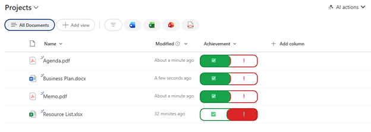

# Yes/No Toggle Switch

## Summary

Displays a Yes/No field as an interactive toggle switch with a sliding indicator. Users can click either side to toggle between Yes (green checkmark) and No (red exclamation). Features a visual slider that moves between positions, providing immediate visual feedback and an intuitive user experience.



## View requirements

|Type|Internal Name|Required|
|---|---|:---:|
|Yes/No (Boolean)|Achievement|Yes|

**Note:** The internal column name must be exactly `Achievement` or you must update all references in the JSON.

## Version history

Version|Date|Comments
-------|----|--------
1.0|January 2026|Initial release

## Disclaimer

**THIS CODE IS PROVIDED *AS IS* WITHOUT WARRANTY OF ANY KIND, EITHER EXPRESS OR IMPLIED, INCLUDING ANY IMPLIED WARRANTIES OF FITNESS FOR A PARTICULAR PURPOSE, MERCHANTABILITY, OR NON-INFRINGEMENT.**

---

## Additional notes

### Features
- **Interactive toggle switch** with clickable left and right sides
- **Visual slider** that moves between positions
- **State indicators:**
  - Yes (True): Green background with ✅ checkmark on left, slider positioned right
  - No (False): Red background with ❗/❕ exclamation on right, slider positioned left
- **Rounded pill design** with smooth borders
- **Click anywhere** on either side to toggle the value
- **Color-coded borders:**
  - Yes side: Green (`#15803d`)
  - No side: Red (`#b91c1c`)

### How It Works
- **When Yes (True):** Left side is filled green with checkmark, slider is on the right (green)
- **When No (False):** Right side is filled red with exclamation, slider is on the left (red)
- **Click left side:** Sets value to Yes/True
- **Click right side:** Sets value to No/False

### Color Scheme
**Yes (True) state:**
- Background: `#16a34a` (green)
- Border: `#15803d` (dark green)
- Text: White

**No (False) state:**
- Background: `#dc2626` (red)
- Border: `#b91c1c` (dark red)
- Text: White

### Column Name Dependencies
⚠️ **Critical:** This formatting references `Achievement` in the `customRowAction`. If your Yes/No column has a different internal name:

1. Find all instances of `"Achievement"` in the JSON
2. Replace with your column's internal name

Example: If your column is called "IsComplete":
```json
"actionInput": {
  "IsComplete": "=if(@currentField , '0' , '1' )"
}
```

### Customization Options

**Change icons:**
- Yes icon: `✅` → `✓`, `☑`, `👍`, `🟢`
- No icon: `❗`/`❕` → `❌`, `✗`, `👎`, `🔴`

**Change colors:**
Replace the hex values:
- Yes background: `#16a34a` → your preferred green
- No background: `#dc2626` → your preferred red
- Adjust borders accordingly

**Adjust size:**
```json
"width": "100px"  // Change from 70px to make sides wider
"padding": "8px 0px"  // Increase for taller switch
```

**Change slider size:**
```json
"height": "40px",  // Change from 30px
"width": "15px"    // Change from 10px
```

### Usage Tips
- Perfect for completion tracking, approval toggles, or feature flags
- Provides tactile, button-like interaction
- Visual slider gives clear feedback on current state
- Recommended column width: 160-180px
- Works best in lists where users need to quickly toggle status

### Common Use Cases
- **Task completion:** "Achieved?" or "Complete?"
- **Approval status:** "Approved?"
- **Feature toggles:** "Enabled?"
- **Attendance:** "Present?"
- **Quality checks:** "Passed?"
- **Availability:** "Available?"

### Accessibility Considerations
The toggle includes:
- Cursor pointer on interactive elements
- Bold text for emphasis
- High contrast colors
- Clear visual state indicators

For better screen reader support, consider the column title clearly indicates Yes/No state.

### Known Limitations
⚠️ **Important considerations:**
- Requires appropriate permissions to edit list items
- The `setValue` action updates the field immediately without confirmation
- Works only with Yes/No (Boolean) columns
- Internal column name must match exactly in the `actionInput`

### Alternative: Three-State Toggle
To support a "Not Set" state, use a Choice column instead with values: "Yes", "No", "Unknown"

### Troubleshooting
**Toggle doesn't work:**
- Verify column internal name matches "Achievement" in the JSON
- Check user has edit permissions on the list
- Ensure column type is Yes/No (Boolean)

**Slider doesn't move:**
- This is a visual representation using borders and colors
- The "movement" is created by changing which side is filled and where the rounded slider element appears

## References

- [Use column formatting to customize SharePoint](https://docs.microsoft.com/en-us/sharepoint/dev/declarative-customization/column-formatting)
- [Custom row actions - setValue](https://docs.microsoft.com/en-us/sharepoint/dev/declarative-customization/formatting-syntax-reference#customrowaction)